# ClipSync Architecture Diagrams & Visual Guide

## 🎯 System Overview Diagram

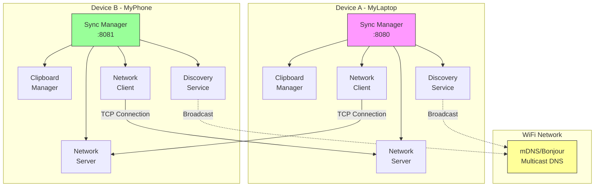

## 🔍 Component Interaction Flow

### 1. Discovery Phase
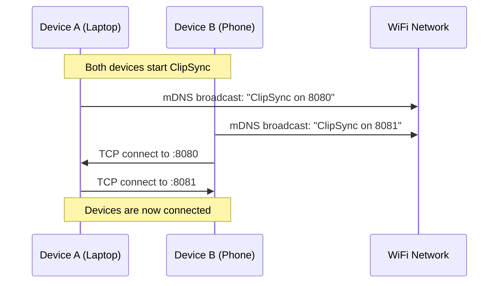

### 2. Clipboard Sync Flow
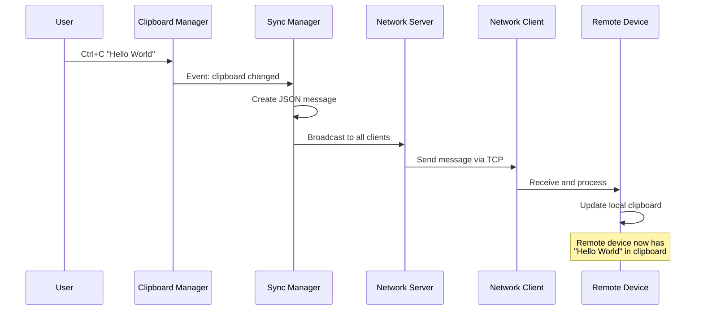

## 🏗️ Detailed Component Architecture

### Clipboard Manager Architecture
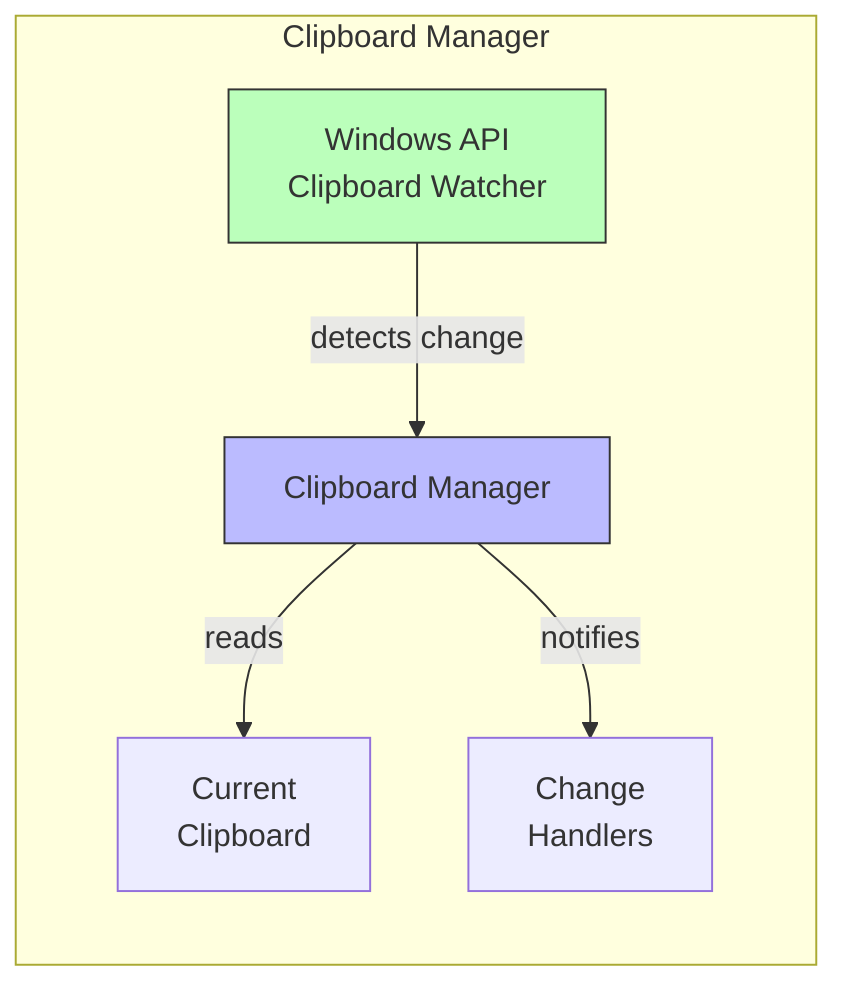

### Discovery Service Architecture
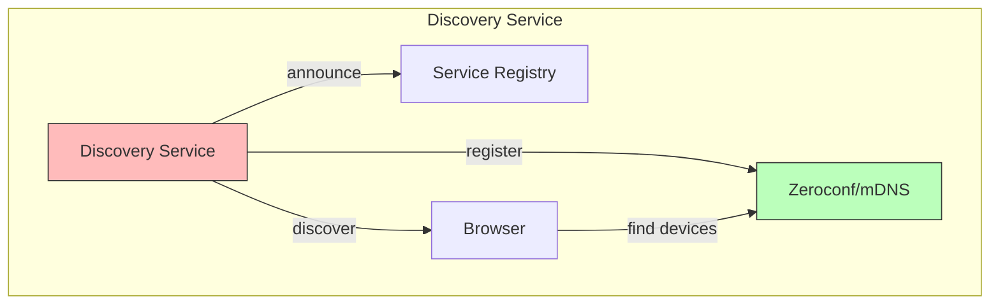

### Network Layer Architecture
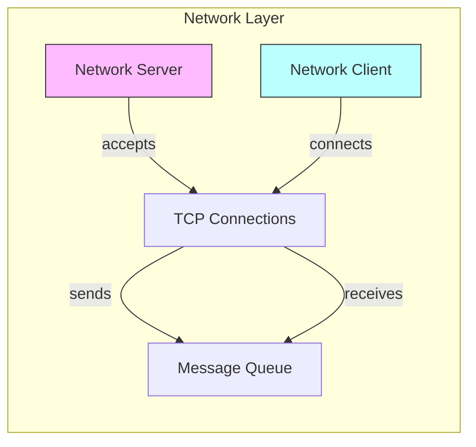

## 🔄 State Machine Diagrams

### Device Connection States
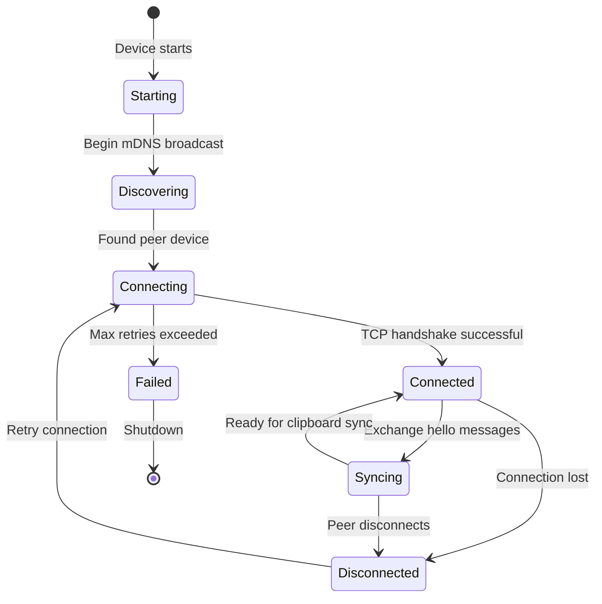

### Message Processing States
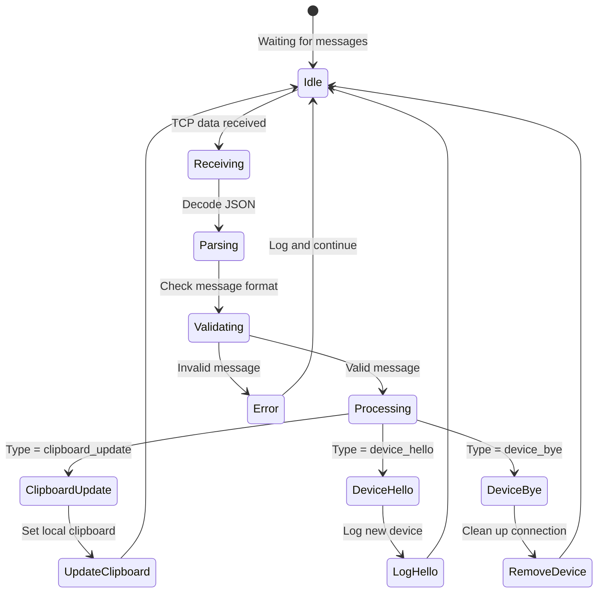

## 📊 Data Flow Architecture

### Message Structure
```json
{
  "header": {
    "type": "clipboard_update|device_hello|device_bye|ping|pong",
    "device_id": "unique_device_name",
    "timestamp": "2024-08-03T22:15:00.000Z"
  },
  "payload": {
    "clipboard_data": {
      "type": "text|image|files",
      "content": "actual clipboard content",
      "size": 1234,
      "metadata": {
        "format": "utf-8",
        "encoding": "base64"
      }
    }
  }
}
```

### Threading Model
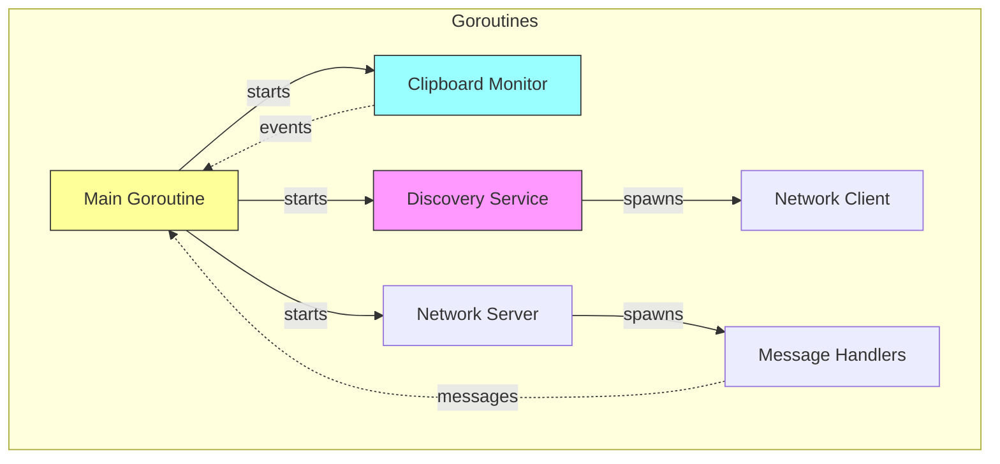

## 🛡️ Error Handling Architecture

### Resilience Patterns
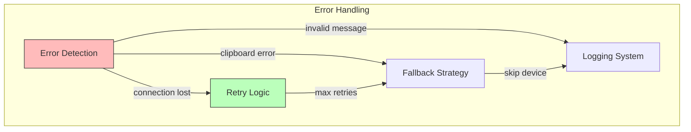

## 🔧 Configuration Architecture

### Settings Hierarchy
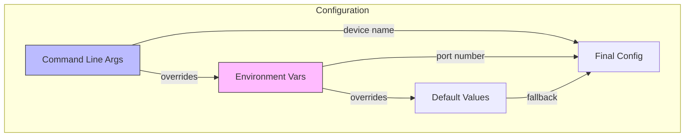

## 📈 Performance Architecture

### Resource Usage Patterns
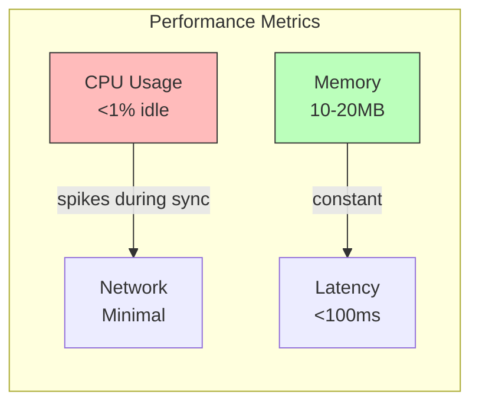

## 🎯 Deployment Architecture

### Single Binary Distribution
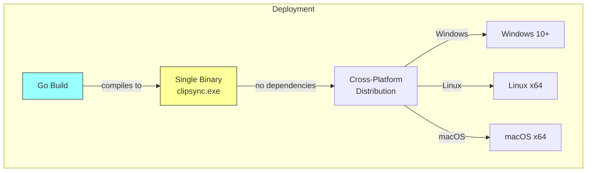

## 🔍 Monitoring Architecture

### Health Check System
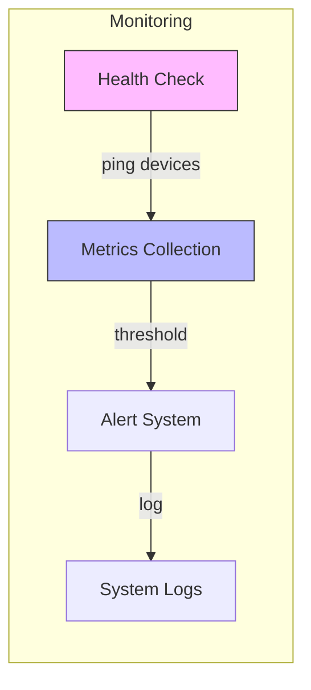

---

*These diagrams represent the complete system architecture of ClipSync, designed for maximum clarity and understanding at all technical levels.*
